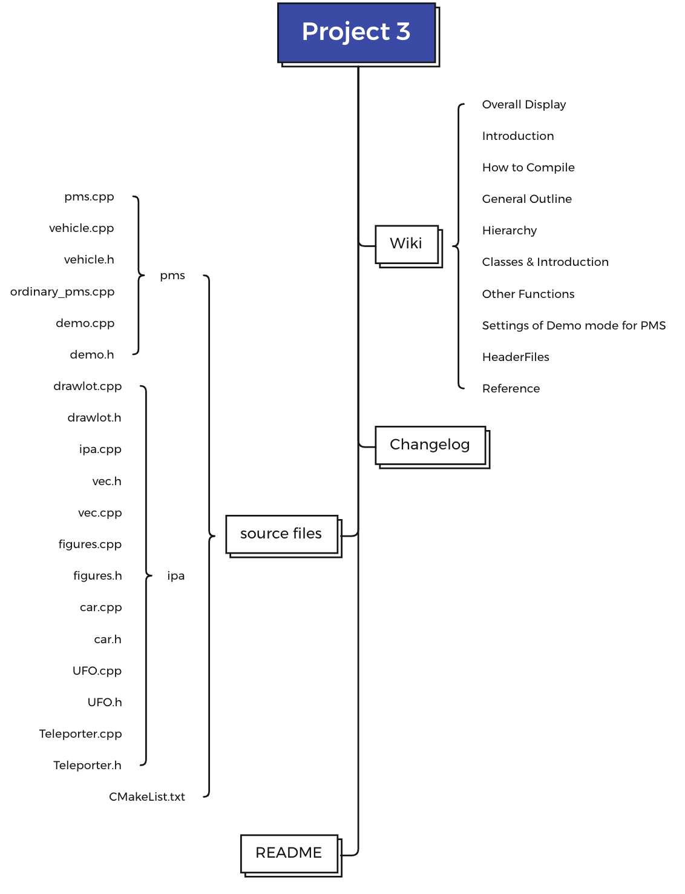
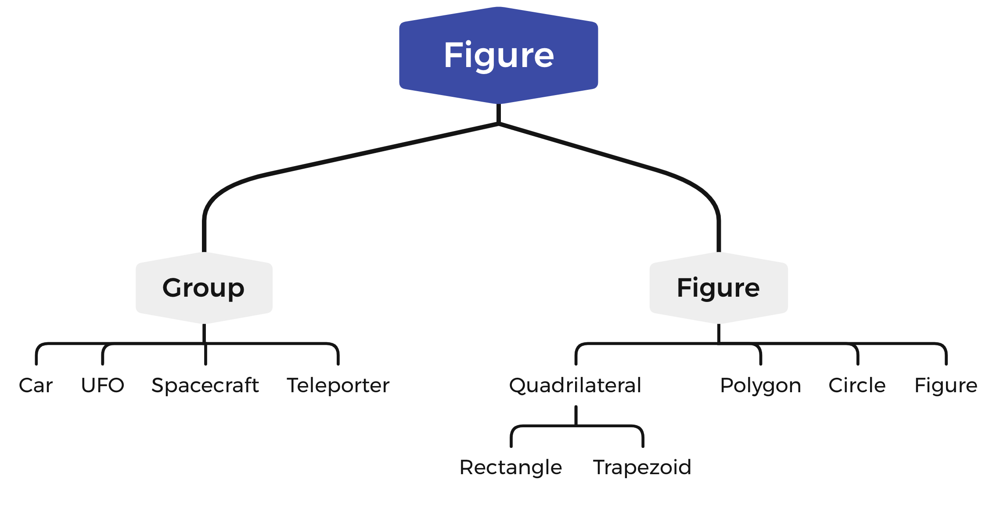

# P3 -- Parking lot software

[](https://focs.ji.sjtu.edu.cn:2222/ENGR151-21/pgroup-13)

Author: 

*     Leyan Zhang (Student ID: 521370910040)
*     Mingqian Ma (Student ID: 521370910175)
*     Zhuoheng Li (Student ID: 521370910132)
*     Zhaokai Lin (Student ID: 521370910027)


## Overall



## Introduction

This program is a simulation of a parking lot in reality and an imaginary interstellar parking lot. 

The parking lot management system is designed to automatically find empty slot corresponding to type for the cars. If there is no slot that fit, we find a larger slot to fit into the slot. It can automatically park into the parking lot and generate an arrival ticket and a departure ticket automatically on which some information about what type is the car, where to park the car, how long time it has stayed within the parking lot, etc. The program simulate a parking lot with various floors with various sizes and it can automatically park and generate parking information as time passes. The program simulate the total process in seconds, as a car is parked into the parking lot, another car waits behind until some time passed and go into the parking lot to find another parking slot.

The interstellar parking animation simulate a interstellar parking lot to part various "vehicles" with different properties and shapes. The program uses OpenGL to draw all the figures and display a one-floor parking lot that shows the whole animation. Different "vehicles" with different "characteristics" do the whole animation. Different figures are drew and shown in the figure.


## Run the Files: 

1. use the CMakelist.txt to compile the files (recommended)

2. use g++ to compile all the files of pms or its (not recommended)

   1. to compile all the codes for pms, use the following command line argument:

      For Mac OS users, use:

   ```
    g++ pms.cpp vehicle.cpp demo.cpp ordinary_pms.cpp -std=c++17 -o p3_part1 -Werror -pedantic -Wall -Wextra -Wvla -framework OpenGL -framework GLUT
    g++ ipa.cpp teleported.cpp drawlot.cpp spacecraft.cpp UFO.cpp vec.cpp figures.cpp car.cpp -o p3_part2 -Werror -pedantic -Wall -Wextra -Wvla -framework OpenGL -framework GLUT
   ```

   ​				For Windows users, use:

   ```
   g++ pms.cpp vehicle.cpp demo.cpp ordinary_pms.cpp -std=c++11 -o p3_part1.exe -Werror -pedantic -Wall -Wextra -Wvla -lglu32 -lfreeglut -lopengl32
   g++ ipa.cpp teleported.cpp drawlot.cpp spacecraft.cpp UFO.cpp vec.cpp figures.cpp car.cpp -o p3_part2.exe -Werror -pedantic -Wall -Wextra -Wvla -lglu32 -lfreeglut -lopengl32
   ```

   ​				For Linux users, use: 

   ```
   g++ pms.cpp vehicle.cpp demo.cpp ordinary_pms.cpp -std=c++11 -o p3_part1 -Werror -pedantic -Wall -Wextra -Wvla -lglut -lGL -lGLU
   g++ ipa.cpp teleported.cpp drawlot.cpp spacecraft.cpp UFO.cpp vec.cpp figures.cpp car.cpp -o p3_part2 -Werror -pedantic -Wall -Wextra -Wvla -lglut -lGL -lGLU
   ```

   Running: run the output executable in command line either with

   `./p3_part1.exe and ./p3_part2.exe` or `./p3_part1 and ./p3_part2`

## Work Distribution

Mingqian Ma: Completed major diagram, discription and coding part in wiki and README. Completed the PMS demo and ordinary parts, codesigned the hierarchy, codesigned the diagram 

Zhuoheng Li: Completed the IPA coding part, codesigned the hierarchy, reorganized the code using Singleton, lots of DEBUGGING

Zhaokai Lin: Wrote the structure of README and wiki, and the codes of the spacecraft, codesigned the hierarchy

Leyan Zhang: Finished the function of calculating ticket price, the function of Vehicle-UFO and Vehicle-teleported, the hierarchy of this project and part of README file and Wiki, codesigned the hierarchy

## Hierarchy




## References: 

    1. all source codes by pgroup-13;
    2. p3.pdf by ENGR151-21 teaching group;
    3. README.md by ENGR151-21 teaching group.

